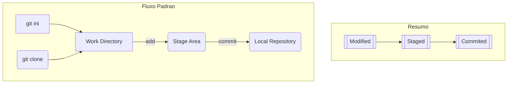

# Estágios dos arquivos no VCS (Git)

## Working Directory

- Todos os nossos arquivos
- Working Tree

## Stage Area

- Preparação dos nossos arquivos, para serem comitados
- Index
- Stage tree

## Repository (local)

- Banco de dados dos nossos arquivos
- Onde ficarão os pontos da história
- Ou o histórico

teste
